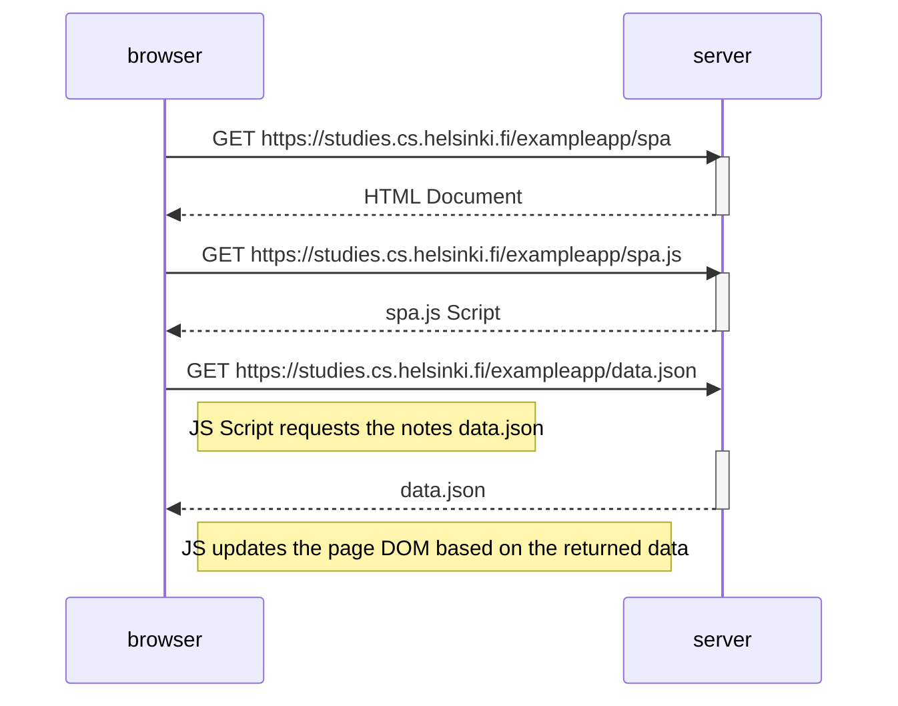

```mermaid
sequenceDiagram
    participant browser
    participant server
    
    browser->>server: GET https://studies.cs.helsinki.fi/exampleapp/spa
    activate server
    server-->>browser: HTML Document
    deactivate server
    
    browser->>server: GET https://studies.cs.helsinki.fi/exampleapp/spa.js
    activate server
    server-->>browser: spa.js Script
    deactivate server
    

    browser->>server: GET https://studies.cs.helsinki.fi/exampleapp/data.json
    note right of browser: JS Script requests the notes data.json
    activate server
    server-->>browser: data.json
    deactivate server
     note right of browser: JS updates the page DOM based on the returned data
    
```