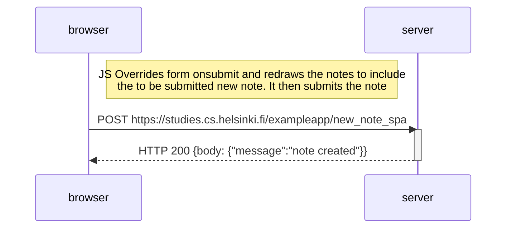

```mermaid
sequenceDiagram
    participant browser
    participant server

    note right of browser: JS Overrides form onsubmit and redraws the notes to include<br>the to be submitted new note. It then submits the note
    
    browser->>server: POST https://studies.cs.helsinki.fi/exampleapp/new_note_spa
    activate server
    server-->>browser: HTTP 200 {body: {"message":"note created"}}
    deactivate server

    
```